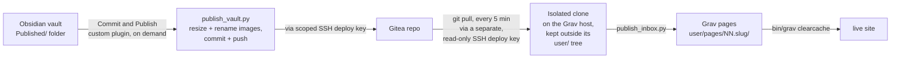

# Obsidian to Grav CMS publishing pipeline

Publishes curated Markdown notes from an Obsidian vault to a live [Grav CMS](https://getgrav.org/) site, through Gitea, with no manual conversion step and no CMS plugin holding write access to live content.

It exists because Grav's own official plugin for this, **Git Sync**, turned out to be unreliable enough (a corrupting admin UI, and twice deleting the entire live `pages/` directory) that it got fully uninstalled and replaced with the two scripts documented here instead. Full write-up, including why Git Sync was dropped, the deploy key setup, and every gotcha hit along the way, is in Parts 2 and 3 of the ["Self-host Obsidian and publish tutorials via an automated pipeline to Grav CMS"](https://tutorials.bachelor-tech.com) series.

## How it fits together



Two independent halves, split across two machines:

- **Desktop** (`optimize_images.py`, `publish_vault.py`, and the Commit and Publish Obsidian plugin): resizes and renames images, then commits and pushes the vault's `Published/` folder to Gitea, all in one deliberate action.
- **The Grav host** (`publish_inbox.py`): pulls from Gitea on a timer and converts whatever it finds into real Grav pages.

Neither side needs to know about the other beyond the shared git repository. The desktop side never touches Grav; the server side never touches the vault.

---

# Desktop: `optimize_images.py`, `publish_vault.py`, and the Commit and Publish plugin

Together these replace Obsidian Git's own commit button as the way this vault's `Published/` folder gets published: they resize and rename images, then commit and push, all in one pass, triggered by a single Obsidian command instead of a background timer.

They exist because Obsidian Git's own commits don't invoke local git hooks (confirmed by testing directly: a real commit went through with an untouched file, no hook output at all, most likely because Obsidian Git commits through its own bundled JavaScript git implementation rather than the system's `git` binary). A pre-commit hook, the obvious first approach, simply never fires for it. Driving `git` directly from a plain script sidesteps the problem entirely.

## What each piece does

- **`optimize_images.py`**: scans the vault for images and, for each one, downscales it if it's wider than a set maximum, and renames it to a consistent, SEO-friendly filename based on the nearest heading above it. Importable, no side effects of its own beyond the file operations, so it can be run standalone (`python optimize_images.py`) or called from another script.
- **`publish_vault.py`**: calls `optimize_images.py`, then commits and pushes whatever changed, using `git` directly rather than any Obsidian plugin. Meant to be run whenever you're ready to publish, not on a schedule.
- **The `Commit and Publish` Obsidian plugin** (`manifest.json` + `main.js`): adds one command to Obsidian's command palette that runs `publish_vault.py` in the background (no console window) and shows a short result notification, so the whole thing is a single keypress once a hotkey is set for it.

## How images get renamed

`Part-N-Heading-Slug-NN.ext`:

- `N` is the part number, read from the referencing note's own filename (a note called "Part 2 - Whatever.md" gives `N = 2`; a note with no "Part N" in its name is left without that prefix).
- `Heading-Slug` is the nearest H2 heading above the image in that note, falling back to the nearest heading of any level if there's no H2 above it. Case is preserved from the heading text on purpose (`Deploy the Obsidian container` becomes `Deploy-the-Obsidian-container`, not lowercased), since the goal is a real, readable filename, not a generic slug.
- `NN` is a two-digit, 1-indexed counter scoped to that exact heading. The first image under a given H2 is `01`, the second under that same H2 is `02`.

The file is moved into an `assets/` folder next to the note that references it. This applies to every image the script can find a note reference for, not just Obsidian's own auto-generated `Pasted image <timestamp>.png` names, a deliberately-placed diagram or icon gets renamed the same way.

Idempotent by design: a file already named exactly what a run would produce is left alone, so running this repeatedly never reshuffles numbers or touches an image twice, and numbering continues correctly from whatever's already on disk rather than restarting at `01` across separate runs.

An image with no note referencing it at all is skipped, there's no heading to build a name from.

## Configuration

Everything is a constant near the top of `optimize_images.py`, no config file or environment variables:

| Constant | Meaning |
|---|---|
| `VAULT_ROOT` | Root folder to scan. Defaults to the script's own folder, so it's meant to sit directly inside `Published/`. |
| `MAX_WIDTH` | Images wider than this get downscaled, preserving aspect ratio. |
| `JPEG_QUALITY` | Quality setting used when resizing a `.jpg`/`.jpeg` (PNG resizing has no equivalent lossy setting). |
| `RESIZE_EXTS` | File extensions treated as raster images. `.gif` and `.svg` are deliberately excluded, animated frames and vector data don't resize the same way. |
| `ASSETS_DIRNAME` | Folder name renamed images get moved into, next to whichever note references them. |
| `AI_NAMING` | Off by default. Flip to `True` and fill in `ai_name_image()` to use a real vision model for naming instead of the heading-based fallback; the function is stubbed but not wired up to any provider yet. |

`publish_vault.py` has one constant of its own worth knowing: the commit message template, `vault backup: <timestamp>`, matching the style Obsidian Git's own auto-commits already use.

## Requirements

- Python 3.10 or newer, plus [Pillow](https://pypi.org/project/Pillow/) (`pip install Pillow`), the only third-party dependency, needed for the actual resizing.
- `git` on `PATH`, with push access already configured for the repo (an SSH deploy key, scoped write, is what this is meant to run with, the same pattern used on the read-only pull side documented below for `publish_inbox.py`).
- On Windows specifically, the plugin expects `python.exe`/`pythonw.exe` at a fixed absolute path (`C:\Python311\pythonw.exe` by default), edit the `PYTHONW` constant in `main.js` if your install lives elsewhere. An absolute path is used deliberately rather than relying on `PATH`, since a plain `python` command isn't guaranteed to resolve correctly inside the environment Obsidian spawns for a plugin, and Windows' own `python.exe` App Execution Alias stub can silently shadow a real install if relied on instead.

## Running it

Not on a schedule. A background timer was the first approach, it worked, but launching a console-subsystem process every few minutes flashes a window on screen, disruptive during anything full-screen. The whole idea got replaced with one deliberate action instead:

1. Install the plugin: copy `manifest.json` and `main.js` into `<vault>/.obsidian/plugins/commit-and-publish/`, add `"commit-and-publish"` to `.obsidian/community-plugins.json`, then restart Obsidian (or reload without saving).
2. Set a hotkey: Settings → Hotkeys → search "Commit and Publish" → click the **+** next to it → press your chosen key combination. Obsidian doesn't ship a default for this, or for Obsidian Git's own commit command either, community plugin commands never get one automatically, so there's nothing existing to match.
3. From then on, press that hotkey (or run the command from the palette) whenever you're ready to publish.

Running `publish_vault.py` by hand for testing works too, from a terminal, inside the repo:

```bash
python publish_vault.py
```

## Debugging

The plugin writes `debug.log` inside its own folder (`.obsidian/plugins/commit-and-publish/debug.log`), cleared at the start of every run so it only ever holds the latest one. Two entries per run: `start` (the resolved paths and whether each one actually exists on disk, useful if something's misconfigured) and `result` (the full stdout/stderr from `publish_vault.py`, plus any error Node itself reported trying to launch it).

## Notes and limitations, and gotchas worth knowing if you adapt this yourself

- **`__pycache__` pollution.** Importing `optimize_images` from `publish_vault.py` creates a `.pyc` cache file inside the vault by default. `sys.dont_write_bytecode = True`, set before the import, stops it; a `.gitignore` entry for `__pycache__/` is a second layer of protection if anything else ever triggers it (a plain `python -m py_compile` run against the file, for instance, ignores that flag entirely).
- **Git subprocess calls need `creationflags=subprocess.CREATE_NO_WINDOW` on Windows**, not just a windowless Python interpreter for the outer process. `publish_vault.py` spawns several `git` subprocesses (pull, add, commit, push, plus two status checks), and each one briefly flashes its own console window regardless of what launched the parent, unless that flag is passed explicitly to every one of them.
- **Node's `child_process.execFile` needs a backslash-style path for the executable itself on Windows**, confirmed by testing directly, a forward-slash path to the same, genuinely-existing file fails with `ENOENT`. This is the opposite of what git's own `core.sshCommand` needs elsewhere in this project (forward slashes there, since that string is interpreted by Git for Windows' bundled `sh.exe` rather than passed to Windows' process creation directly).
- **`__dirname` isn't reliable inside an Obsidian plugin.** Obsidian loads plugins through its own mechanism, not Node's normal `require()`, and `__dirname` isn't guaranteed to resolve correctly there. Build any in-plugin file paths from `app.vault.adapter.getBasePath()` instead.
- **Checking only for uncommitted changes isn't enough**, since Obsidian Git's own auto-commit (its auto-push, not auto-commit, is what's disabled) can commit locally before `publish_vault.py` ever runs, leaving nothing for `git add` to pick up despite there being a genuinely unpushed commit sitting there. `publish_vault.py` checks `git rev-list @{u}..HEAD --count` as a separate condition and pushes if either that or the ordinary uncommitted-changes check comes back true.
- **Renaming applies retroactively to every image, including ones already live and published**, not just newly added ones. That was a deliberate choice for this vault (a consistently-named `assets/` folder mattered more than preserving old URLs), not an inherent requirement, gate the rename on the filename still looking auto-generated if you'd rather it only apply going forward.

---

# Server (the Grav host): `publish_inbox.py`

A small, dependency-free Python script that converts a folder of Markdown files (the same `Published/` folder pushed by the desktop side above, pulled through git) into real pages for Grav CMS.

## What it does

On each run, the script:

1. Pulls the latest content from an isolated git clone (kept entirely outside Grav's own `user/` tree, so nothing about it can touch Grav's actual content by accident).
2. Walks that clone's top level:
   - Loose `.md` files become single, standalone pages.
   - Subfolders become multi-part series, with each `.md` file inside becoming one part.
3. Converts each file's content into a Grav page: extracts a title, rewrites Obsidian-style wikilinks and image embeds, copies referenced images alongside the generated page, and writes proper Grav frontmatter.
4. Removes any page it previously created whose source has since been renamed or deleted, so nothing is ever left behind as a stale duplicate.
5. Clears Grav's cache so the change is visible immediately.
6. `Home.md` and `All Articles.md` at the vault root are special-cased to overwrite Grav's own `01.home` and `02.articles` pages directly, rather than becoming ordinary numbered pages.
7. Re-chowns everything under `user/pages/` to the container's `www-data` UID/GID, since the script itself runs as root and Grav's admin UI needs to be able to edit what it writes.

## Expected repo layout

The script assumes the git clone's root *is* the vault's `Published/` folder (no extra nesting), laid out like this:

```
repo-root/
├── Some Standalone Article.md          -> one single-part page
└── A Multi-Part Series/
    ├── Part 1 - Introduction.md        -> becomes part 01 of the series
    ├── Part 2 - Deep Dive.md           -> becomes part 02
    └── assets/
        └── screenshot.png              -> available to every part in the series
```

Parts within a series are ordered by a leading "Part N" in the filename where present, alphabetically otherwise. Any image anywhere under a series folder (including nested subfolders) is available to every part in that series, matched by filename alone. This is also exactly the layout `optimize_images.py` (above) keeps the vault in, so the two halves of this pipeline agree on structure without either one needing to know about the other's code.

## Conversion rules

- **Title**: the first genuine `# Heading` line in the file, stripped from the body afterward. Headings that fall inside a fenced ` ``` ` code block are correctly ignored (a bash comment like `# 1. Do the thing` is never mistaken for the page title). If no real heading exists anywhere, the filename is used instead.
- **Wikilinks**: `[[Note Name]]` and `[[Note Name|Display text]]` are rewritten to relative Grav links, resolved through a title-to-slug map built once across the entire batch before any page is written, so cross-references between articles in the same run always resolve correctly.
- **Images**: both Obsidian's embed syntax (`![[image.png]]`, with an optional `|width` suffix which is dropped) and plain Markdown image syntax (``) are rewritten to a normal `` reference, resolved by filename regardless of the original path. A URL-encoded path (`%20` for spaces, etc., common when an editor writes standard Markdown syntax for a pasted screenshot) is decoded before that lookup, so it still resolves correctly. The image itself is copied alongside the generated page, and given a lightbox link plus a size class chosen from the image's own pixel height (a short, wide screenshot doesn't end up as a tiny sliver at a fixed width).
- **Mermaid diagrams**: a ` ```mermaid ` fenced code block is translated into `[mermaid]...[/mermaid]`, the shortcode expected by Grav's `mermaid-diagrams` plugin, which has no idea what a fenced code block is. This keeps the source Markdown in standard, portable syntax (renders natively in Obsidian and Gitea too) while still producing a real diagram on the published page.
- **Fenced code blocks and inline code spans** are protected from all of the rewriting above. Nothing inside a ` ``` ` block or a single-backtick `` `span` `` (a bash comment, a Mermaid subroutine shape like `[[Foo]]`, or a literal `` `[[Note Name]]` `` given as a syntax example) is ever mistaken for real Obsidian syntax.
- **Ordering**: top-level pages (both standalone articles and whole series) are sorted newest first, by each entry's earliest git commit date.
- **Cleanup**: tracked through a manifest file (see below). Applies both to whole top-level entries and to individual parts inside a series, so a renamed or deleted part never leaves its old folder behind as an orphaned duplicate.

## Configuration

Everything is a constant near the top of the file, no config file or environment variables:

| Constant | Meaning |
|---|---|
| `SOURCE_REPO` | Path to the isolated git clone this script reads from. |
| `PAGES_DIR` | Grav's `user/pages/` directory, where generated pages are written. |
| `MANIFEST_PATH` | Where the script records what it has previously created, for cleanup. |
| `START_INDEX` | First numeric prefix used for generated top-level page folders (default `10`, leaving `01`/`02` free for Grav's own default pages). |
| `RESERVED_SLUGS` | Slugs the script must never generate, because Grav already uses them (its own default `home`/`typography` pages). A colliding title gets `-post` appended to its slug instead. |
| `IGNORED_TOP_LEVEL` | Entries at the repo root the script skips outright (`.git`, `.gitignore`, `.htaccess`). |
| `IMAGE_EXTS` | File extensions treated as images when resolving embeds. |

## Requirements

- Python 3.10 or newer (uses `X | None` type hints). No third-party packages; only the standard library.
- `git` on `PATH`, with read access already configured for `SOURCE_REPO` (an SSH deploy key, scoped read-only, is what this is meant to run with, the counterpart to the write-scoped key used on the desktop side above).
- `docker` on `PATH`, with a running container named `grav`, for the final cache-clear step. This step is best-effort: its output is captured and ignored if it fails, so a missing container doesn't stop the page conversion itself from completing.
- Grav's [`mermaid-diagrams`](https://github.com/DanielFlaum/grav-plugin-mermaid-diagrams) plugin installed (`bin/gpm install mermaid-diagrams`), if any content uses ` ```mermaid ` fences. Without it, the `[mermaid]...[/mermaid]` shortcode this script produces just renders as literal text, nothing breaks, it simply won't be a diagram.

## Running it

Meant to run unattended, on a schedule, not manually. The reference deployment uses a systemd timer:

```ini
# /etc/systemd/system/grav-publish.timer
[Unit]
Description=Run grav-publish.service every 5 minutes

[Timer]
OnBootSec=2min
OnUnitActiveSec=5min
AccuracySec=30s

[Install]
WantedBy=timers.target
```

```ini
# /etc/systemd/system/grav-publish.service
[Unit]
Description=Convert Grav _inbox/ content into published pages
After=docker.service

[Service]
Type=oneshot
ExecStart=/usr/bin/python3 /opt/grav/publish_inbox.py
```

Polling on a timer was chosen deliberately over a webhook receiver: no inbound endpoint to secure, and a host that was offline when a push happened simply catches up on its next tick, rather than needing that push replayed.

Running it by hand for testing:

```bash
python3 publish_inbox.py
```

It prints one line per page written, one line per stale page or part removed, and a final summary. Safe to run repeatedly; a run with nothing changed just reports the same pages again.

## Notes and limitations

- Only `.md` files are ever converted into pages. Any other file type placed in a series folder (a script, a JSON blueprint, and so on) is silently ignored, it is neither a part nor an image, so the script has no rule for it. Link to such files from within the Markdown instead (a plain link to wherever they're actually hosted); the wikilink and image rewriting rules don't touch ordinary Markdown links, so they pass through untouched.
- The manifest (`MANIFEST_PATH`) is what makes cleanup possible. Deleting it doesn't break anything on the next run, but it does mean the script loses track of what it previously created, so nothing gets cleaned up until the next rename or deletion happens naturally after that.
- No file locking. Two overlapping runs (a very short interval combined with a very large batch) could in theory race on `PAGES_DIR`. Not a concern at the default 5-minute interval against a personal tutorial archive's content volume, worth knowing if this gets adapted for something with much heavier publishing throughput.
